# Banking Microservices Platform

A production-ready microservices architecture simulating a banking backend, built with **Spring Boot**, **Spring Cloud**, and **Docker**.

---

## Architecture



The platform is built around independent, loosely coupled services orchestrated in a fully containerized environment. It follows these core principles:

- **Reverse Proxy** via Nginx — single entry point for all client traffic, routing requests to the correct service
- **Service Discovery** via Eureka — services register themselves and locate each other dynamically, with no hardcoded addresses
- **Centralized Configuration** via Spring Cloud Config — all services pull their configuration from a single source of truth
- **Distributed Tracing** via Zipkin — full request tracing across all services for visibility and debugging
- **Containerized Deployment** via Docker — the entire stack runs identically on any machine
- **Clear Separation of Business Concerns** — each domain (accounts, cards, loans) is an isolated, independently deployable service

---

## Components

| Service | Description | Port |
|---|---|---|
| **Nginx** | Reverse proxy — single entry point for all API traffic | `80` |
| **Eureka Server** | Service registry for dynamic service discovery | `8761` |
| **Config Server** | Centralized configuration server for all services | `8071` |
| **Accounts Service** | Manages customer accounts and profiles | internal `8080` |
| **Cards Service** | Manages customer credit and debit cards | internal `9000` |
| **Loans Service** | Manages customer loan products | internal `9001` |
| **PostgreSQL** | Relational database — one schema per service | internal `5432` |
| **Zipkin** | Distributed tracing UI | `9411` |

---

## Prerequisites

Make sure you have the following installed:

- **Docker** and **Docker Compose**

That's it. The build happens inside Docker — no local Java or Maven installation required.

---

## Quick Start

**1. Clone the repository:**
```bash
git clone https://github.com/khaldountaktak/cassiope.git
cd cassiope
```

**2. Create your environment file:**
```bash
cp .env.example .env
# Edit .env and fill in your values
```

**3. Build and start the entire stack:**
```bash
docker-compose up --build
```

Docker will compile the source code, package each service into a JAR, build the images, and start all containers automatically.

**4. Access the services:**

| Interface | URL |
|---|---|
| Accounts API | http://localhost/accounts/ |
| Cards API | http://localhost/cards/ |
| Loans API | http://localhost/loans/ |
| Eureka Dashboard | http://localhost:8761 |
| Config Server | http://localhost:8071 |
| Zipkin Tracing UI | http://localhost:9411 |

> All API traffic goes through Nginx on port 80. The individual service ports are not exposed externally.

---

## Development Workflow

To rebuild and restart after code changes:
```bash
docker-compose up --build
```

To start without rebuilding (if images are already built):
```bash
docker-compose up
```

To stop all services:
```bash
docker-compose down
```

To stop and wipe all data (full reset):
```bash
docker-compose down -v
```

To view logs for a specific service:
```bash
docker-compose logs -f accounts
```

---

## Database

Each microservice has its own dedicated PostgreSQL database, following the **database-per-service** pattern:

- `eazybank_accounts`
- `eazybank_cards`
- `eazybank_loans`

Databases are automatically created on first startup via `init.sql`. PostgreSQL is not exposed externally — only reachable by services inside the Docker network.

---

## Distributed Tracing

Every request is automatically traced across services using **Micrometer + Zipkin**. To see traces:

1. Make any API call through Nginx
2. Open the Zipkin UI at http://localhost:9411
3. Click **Run query** to see all recent traces

Each trace shows the full request timeline including inter-service Feign calls and database queries.